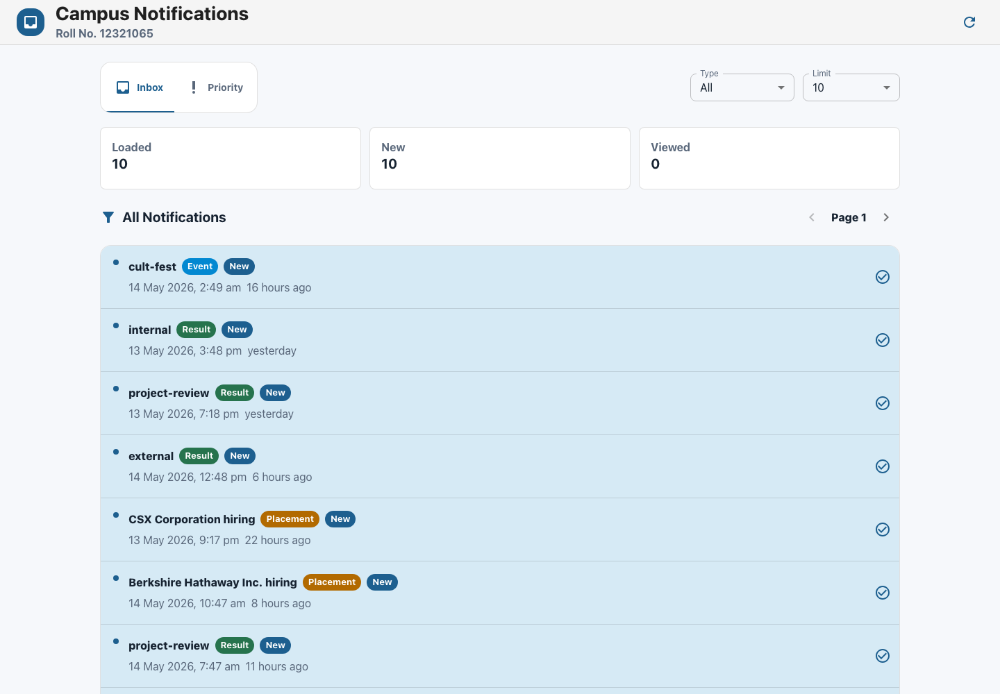
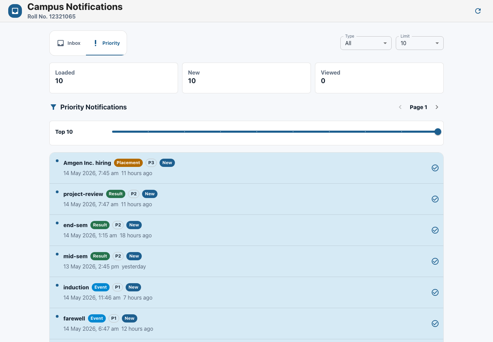
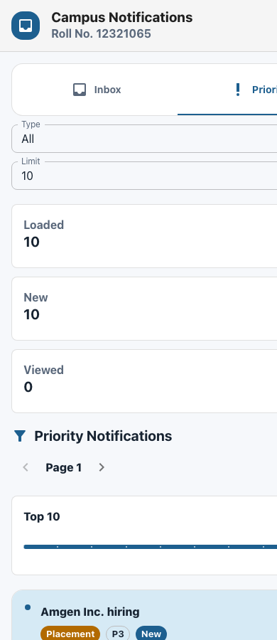

# Campus Notifications Frontend

React + Material UI notification dashboard for the AffordMed campus hiring evaluation.

## Screenshots

### Inbox



### Priority Notifications



### Mobile View



## Run

```bash
npm install
npm run dev
```

The Vite server is pinned to:

```text
http://localhost:3000
```

To serve the production build locally:

```bash
npm run build
npm run preview
```

## Environment

Copy `.env.example` to `.env.local` and fill the AffordMed credentials:

```text
VITE_AFFORDMED_BASE_URL=http://4.224.186.213/evaluation-service
VITE_AFFORDMED_EMAIL=
VITE_AFFORDMED_NAME=
VITE_AFFORDMED_ROLL_NO=
VITE_AFFORDMED_ACCESS_CODE=
VITE_AFFORDMED_CLIENT_ID=
VITE_AFFORDMED_CLIENT_SECRET=
```

The local Vite proxy requests a fresh short-lived token and forwards:

- `GET /api/notifications`
- `POST /api/logs`

## Verify

```bash
npm run build
```

The UI supports the API query parameters `limit`, `page`, and `notification_type`, shows all notifications and priority notifications on separate hash views, and stores viewed/new state in `localStorage`.
